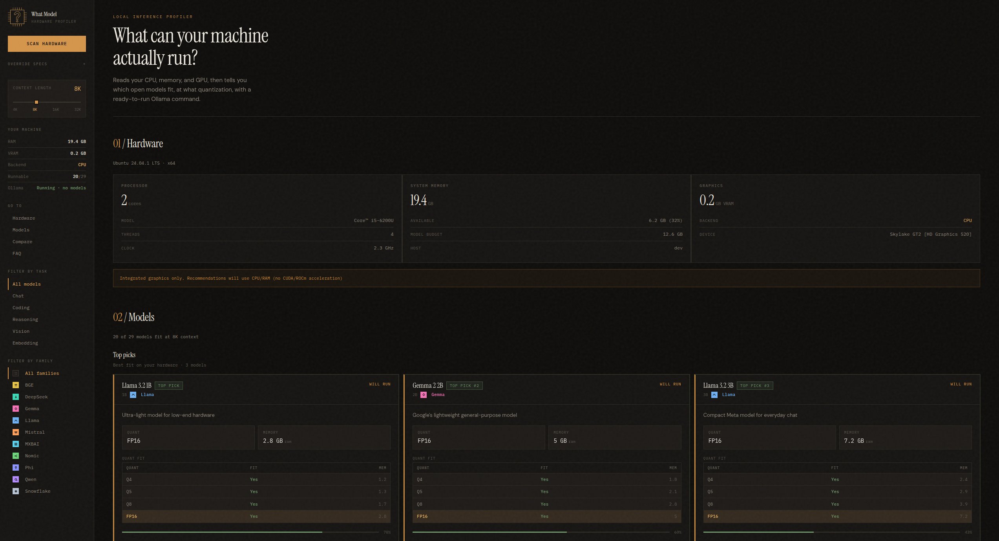
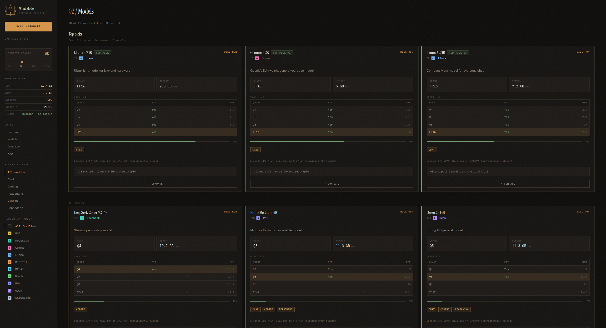
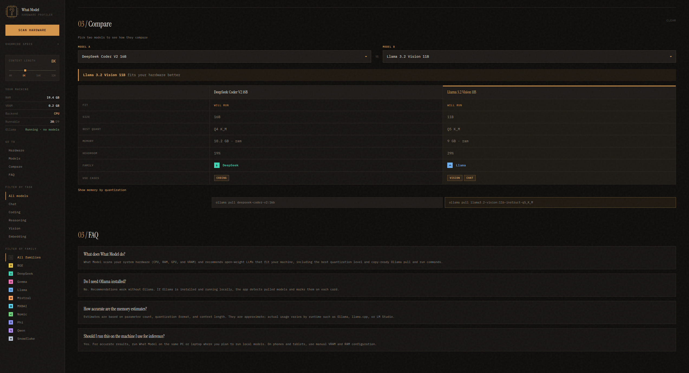

<p align="center">
  
</p>

<h1 align="center">What Model</h1>

<p align="center">
  <strong>A local hardware profiler that tells you which open-weight LLMs your machine can actually run.</strong>
</p>

<p align="center">
  Scan CPU, RAM, GPU, and VRAM · Rank models by fit · Copy ready-to-run Ollama commands
</p>

<p align="center">
  <a href="LICENSE"></a>
  <a href="https://nodejs.org"></a>
  <a href="https://nextjs.org"></a>
  <a href="https://react.dev"></a>
  <a href="https://www.typescriptlang.org"></a>
</p>

<p align="center">
  <a href="https://tailwindcss.com"></a>
  <a href="https://vitest.dev"></a>
  <a href="https://ollama.com"></a>
  
</p>

<p align="center">
  <a href="#features">Features</a> ·
  <a href="#screenshots">Screenshots</a> ·
  <a href="#quick-start">Quick start</a> ·
  <a href="#api">API</a> ·
  <a href="#development">Development</a>
</p>

---

## Overview

What Model scans the machine it runs on, estimates memory requirements per quantization, and ranks open-weight models by fit—with copy-ready Ollama commands when you are ready to pull or run.

> **Run this on the same computer you plan to use for inference.** Hardware detection is local; memory estimates are approximate and vary by runtime.

---

## Screenshots

<p align="center">
  
</p>

<p align="center"><sub>Hardware scan, fit tiers, top picks, and family filters in one view.</sub></p>

<table align="center">
  <tr>
    <td align="center" width="50%">
      
      <br />
      <sub>Per-model quant fit, memory estimates, and Ollama commands</sub>
    </td>
    <td align="center" width="50%">
      
      <br />
      <sub>Compare two models head-to-head on your hardware</sub>
    </td>
  </tr>
</table>

---

## Features

### Hardware profiling
- Detects **CPU**, **system RAM**, **GPU(s)**, and **usable VRAM**
- Identifies compute backend: **CUDA**, **Metal**, **ROCm**, or **CPU-only**
- Supports **manual VRAM/RAM overrides** for planning upgrades or what-if scenarios
- **Mobile and tablet fallback** with manual configuration when GPU detection is unavailable

### Model recommendations
- Curated catalog of **29 open-weight models** across **10 families** (Llama, Qwen, Mistral, DeepSeek, Gemma, Phi, and embedding models)
- Fit tiers: **Best fit**, **Good fit**, **Will run**, **Won't run**
- **Top picks** surfaced automatically based on hardware and filters
- Filter by **task** (chat, coding, reasoning, vision, embedding) or **model family**
- Adjustable **context length** (4K–32K tokens) with live memory recalculation

### Quantization and memory
- Per-model breakdown for **Q4_K_M**, **Q5_K_M**, **Q8_0**, and **FP16**
- Interactive quant selection on each model card
- Memory estimates include weights, KV cache, and runtime overhead

### Ollama integration
- Detects whether Ollama is **installed** and **running**
- Lists **pulled models** and marks them on recommendation cards
- Generates accurate **`ollama pull`** and **`ollama run`** commands per quantization

### Comparison and workflow
- Side-by-side **model compare** for two candidates
- **Spec override** panel for what-if scenarios
- Responsive layout with a collapsible sidebar on smaller screens

---

## Quick start

### Prerequisites

- **Node.js 18+**
- **npm** (or compatible package manager)
- Optional: [Ollama](https://ollama.com) installed locally for pull/run command integration

### Install and run

```bash
git clone https://github.com/your-org/what-model.git
cd what-model
npm install
npm run dev
```

Open [http://localhost:3000](http://localhost:3000), click **Scan hardware**, and browse recommendations.

---

## How recommendations work

Memory usage is estimated from parameter count, quantization format, context length, and a fixed overhead multiplier:

```
totalGB ≈ (paramsB × bytesPerParam + kvCacheGB) × 1.10
```

| Quantization | Bytes per parameter |
|--------------|---------------------|
| Q4_K_M       | 0.55                |
| Q5_K_M       | 0.70                |
| Q8_0         | 1.00                |
| FP16         | 2.00                |

**Fit tiers** are derived from available memory headroom:

| Tier | Condition |
|------|-----------|
| Best fit | ≥ 20% headroom on the target memory pool (GPU or RAM) |
| Good fit | ≥ 10% headroom |
| Will run | Fits with less headroom, or falls back to CPU/RAM |
| Won't run | Insufficient memory at any supported quantization |

Models that exceed discrete VRAM but fit in system RAM are flagged as CPU/RAM inference candidates.

---

## API

All routes are dynamic and intended for local use alongside the web UI.

### `GET /api/system`

Returns the detected hardware profile (CPU, RAM, GPUs, compute backend, warnings).

### `GET /api/ollama`

Returns Ollama installation status, running state, and pulled model tags.

### `GET /api/recommend`

Returns a full recommendation payload: system profile, ranked models, Ollama status, and applied filters.

| Query parameter | Type | Description |
|-----------------|------|-------------|
| `useCase` | `chat` \| `coding` \| `reasoning` \| `vision` \| `embedding` | Filter by task |
| `family` | `llama` \| `mistral` \| `qwen` \| `deepseek` \| `phi` \| `gemma` \| `nomic` \| `bge` \| `mxbai` \| `snowflake` | Filter by model family |
| `contextTokens` | `4096` \| `8192` \| `16384` \| `32768` | Context window for KV cache estimation (default: `8192`) |
| `vramGB` | number | Override usable VRAM |
| `ramGB` | number | Override usable system RAM |
| `maxResults` | number | Limit number of recommendations (default: `50`) |

**Example**

```bash
curl "http://localhost:3000/api/recommend?useCase=coding&family=qwen&contextTokens=8192"
```

---

## Project structure

```
what-model/
├── docs/
│   └── screenshots/          # README and marketing screenshots
├── src/
│   ├── app/                  # Next.js App Router pages and API routes
│   ├── components/           # UI components (cards, sidebar, compare, etc.)
│   ├── lib/
│   │   ├── engine/           # Recommendation and VRAM estimation logic
│   │   ├── hardware/         # System detection (systeminformation, nvidia-smi)
│   │   ├── models/           # Model catalog and family metadata
│   │   └── ollama/           # Ollama client and command generation
│   └── types/                # Shared TypeScript types
└── tests/                    # Vitest unit tests
```

---

## Development

| Command | Description |
|---------|-------------|
| `npm run dev` | Start the development server |
| `npm run build` | Create a production build |
| `npm run start` | Serve the production build |
| `npm test` | Run unit tests (Vitest) |
| `npm run test:watch` | Run tests in watch mode |
| `npm run lint` | Run ESLint |

---

## Platform notes

| Platform | Behavior |
|----------|----------|
| **Linux + NVIDIA** | GPU detection via `systeminformation`, with `nvidia-smi` fallback |
| **macOS (Apple Silicon)** | Unified memory heuristic (~70% of total RAM treated as usable for GPU workloads) |
| **AMD ROCm** | Backend detected when supported GPUs are present |
| **Mobile / tablet** | Manual VRAM and RAM configuration; no reliable discrete GPU detection |

---

## Limitations

- Memory figures are **estimates**. Actual usage depends on runtime (Ollama, llama.cpp, LM Studio), batch size, and system load.
- The model catalog is a **curated static list**. It is not synced automatically with the Ollama library.
- GPU detection quality varies by OS, drivers, and container environment.
- This tool is designed to run **locally**, not as a hosted multi-tenant service.

---

## License

[MIT](LICENSE)
